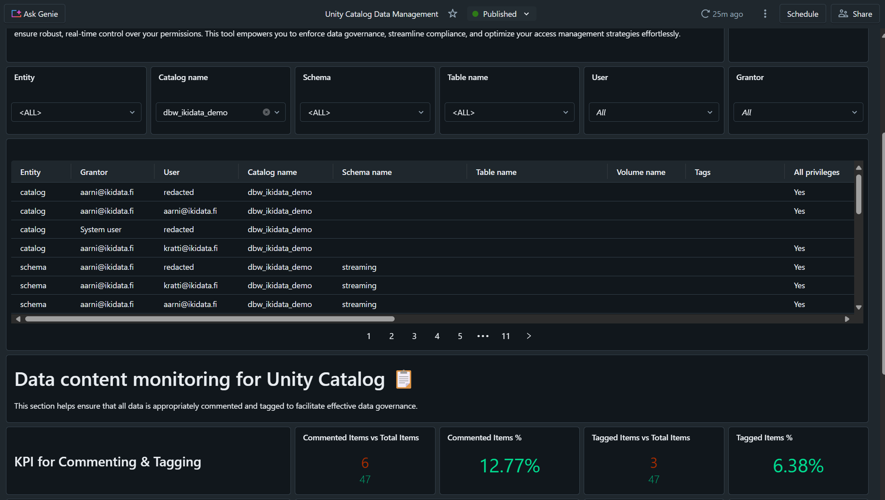

# Unity Catalog Data Management AI/BI Dashboard

Unity Catalog is amazing, but are you struggling to view everything from a single dashboard? To solve this issue, we developed an easy-to-use AI/BI dashboard that centralizes permissions, tags, and comments — all in one place. It supports a hierarchical view covering catalogs, schemas, tables, and volumes.
## Table of Contents

- [Introduction](#introduction)
- [Installation](#installation)
- [Usage](#usage)
- [Known limitations](#Limitations)
- [More information](#More-information)

## Introduction

This dashboard provides permission management, along with tag and comment monitoring. The solution relies solely on system tables, ensuring it automatically works across all Databricks workspaces — as long as users have the appropriate permissions to access the underlying tables. You can filter based on entity hierarchy or at a component level. While filters are built using dynamic parameters, there are limitations due to the source data hierarchy. Please note that this is an initial implementation that can serve as a foundation for further development and customization.

## Installation 

While AI/BI dashboards can be imported programmatically, in this case, manual import via the dashboards subpage is recommended. The AI/BI dashboard is available in JSON format in the "files" folder and is ready for immediate use once imported.

**Tables the dashboard is using:**
* system.information_schema.catalogs  
* system.information_schema.catalog_tags  
* system.information_schema.catalog_privileges
* system.information_schema.schemata
* system.information_schema.schema_tags  
* system.information_schema.schema_privileges  
* system.information_schema.tables
* system.information_schema.table_tags
* system.information_schema.table_privileges  
* system.information_schema.volumes
* system.information_schema.volume_tags  
* system.information_schema.volume_privileges 
 

## Usage
Once imported, the AI/BI Dashboard is ready for immediate use. It automatically operates using system tables, provided that the user has access to the underlying data. The first visualization displays permissions at the catalog, schema, table, and volume levels—note that items without any assigned permissions will not appear in the table. The second visualization tracks tagging and commenting on an item level, while dynamic filters enable detailed drill-down capabilities to enhance your overall experience.

## Limitations
* In permission management table values aren't shown if there aren't any given permissions given on the object
* Dynamic filtering from bottom to upper on a hierarchy level is not working perfectly
* Possibility to filter based on permission right

## More information
To stay up-to-date with the latest developments: 
1) Follow Ikidata on LinkedIn: https://www.linkedin.com/company/ikidata/ 
2) Explore the solutions available on our website: https://www.ikidata.fi

## **Standardized? Let's automate it.**

